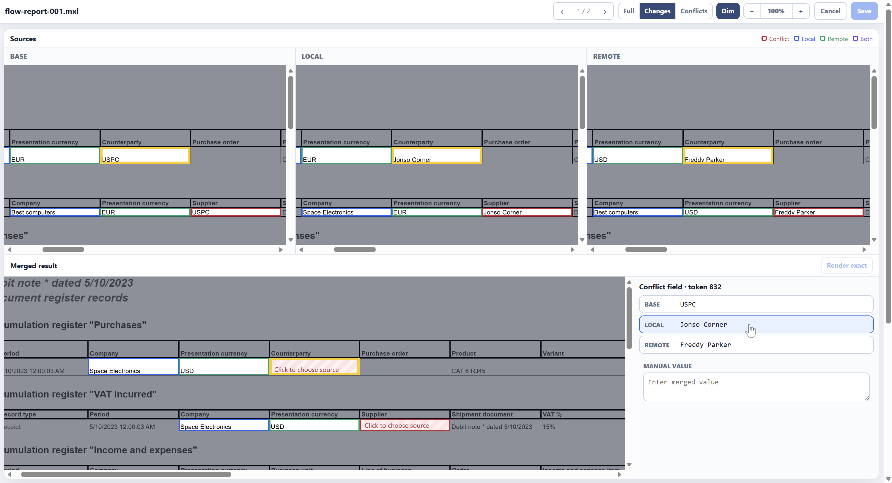

# MXL Merge Tool

Инструмент семантического сравнения и трёхстороннего слияния табличных
документов 1С в формате `.mxl` (`MOXCEL`). Он подключается к Git как diff- и
merge-драйвер, автоматически объединяет независимые изменения и открывает
локальный визуальный редактор только для настоящих конфликтов.

Основная часть написана на Python и использует только стандартную библиотеку.
Платформа 1С необязательна: без неё доступно семантическое сравнение, а с ней —
визуальное представление исходных и итогового табличных документов.




## Возможности

- стабильный текстовый diff для бинарных `.mxl`;
- автоматическое трёхстороннее слияние Base/Local/Remote;
- визуальное разрешение конфликтов в браузере;
- выбор значения из Base, Local или Remote, опциональный ручной ввод значения для строковых и атомарных полей;
- одновременный просмотр Base, Local, Remote и результата;
- подсветка конфликтов и односторонних изменений;
- повторная проверка структуры MXL перед записью результата;
- работа из командной строки, Git Extensions и других клиентов Git.

## Ограничения

Инструмент надёжно объединяет изменения значений, когда сериализованная
структура Base, Local и Remote совпадает. Одностороннее изменение структуры
принимается автоматически, если вторая сторона семантически не отличается от
Base.

Если обе стороны одновременно меняют количество или порядок строк, колонок либо
других структурных блоков, инструмент обнаруживает структурный конфликт, но не
пытается угадать соответствие строк. В UI можно выбрать целиком Base, Local или
Remote. Поэлементное объединение двусторонних структурных изменений **пока** не
поддерживается.

Привязка подсветки к HTML, созданному 1С, выполняется по видимому тексту и номеру
его появления. Поэтому конфликт метаданных, невидимое значение или одинаковые
повторяющиеся подписи могут отображаться только в блоке `Conflict decisions`,
даже если сам конфликт корректно найден и разрешается.

## Требования

- Git;
- Python 3.10 или новее;
- любой современный браузер;
- для точного визуального предпросмотра — Windows и установленная платформа
  1С:Предприятие с `1cv8c.exe` и `1cv8.exe` одной версии.

Для семантического diff и merge платформа 1С не требуется.

## Состав

```text
mxl-merge-tool/
├── mxl_tool.py       # CLI, Git diff/merge drivers и установщик
├── mxl_ui.py         # локальный HTTP-сервер визуального редактора
├── mxl_preview.py    # семантический и HTML-предпросмотр
├── mxl_onec.py       # запуск конвертера через 1С
├── ui.html           # интерфейс разрешения конфликтов
├── onec/
│   ├── MxlToHtml.epf
│   ├── MxlToHtml.bsl
│   └── MxlRendererTemplate.dt
└── tests/
```

## Быстрая установка в один репозиторий

Запустите команду из корня Git-репозитория:

```bash
python3 mxl_tool.py install
```

На Windows:

```bat
python mxl_tool.py install
```

Установщик:

1. добавит diff- и merge-драйверы `mxl` в локальный `.git/config`;
2. зарегистрирует визуальный mergetool `mxl`;
3. добавит в корневой `.gitattributes` правило:

```gitattributes
*.mxl -text diff=mxl merge=mxl
```

Проверка установки:

```bash
git check-attr diff merge -- path/to/template.mxl
```

Ожидаемый результат:

```text
path/to/template.mxl: diff: mxl
path/to/template.mxl: merge: mxl
```

Файл `.gitattributes` следует добавить в репозиторий, чтобы правило действовало
у всех разработчиков. Локальные команды драйверов всё равно должен один раз
установить каждый пользователь.

## Глобальная установка

Чтобы зарегистрировать инструмент для всех репозиториев текущего пользователя:

```bash
python3 /absolute/path/to/mxl_tool.py install --global
```

На Windows:

```bat
python C:\mxl_tool.py install --global
```

Глобальная установка создаёт отдельный global attributes file и записывает его
в `core.attributesFile`. Каталог с инструментом после установки нельзя
перемещать: Git сохраняет абсолютный путь к `mxl_tool.py`.

Если `install` запущен вне Git-репозитория, инструмент сообщает об этом и
автоматически переходит к глобальной установке.

## Подключение визуального предпросмотра 1С

Передайте установщику путь к тонкому клиенту:

```bat
python mxl_tool.py install ^
  --onec-client "C:\Program Files\1cv8\8.3.27.2074\bin\1cv8c.exe"
```

Путь сохраняется в параметре Git `mxl.onecClient`. `1cv8.exe` должен находиться
рядом с указанным `1cv8c.exe`.

При первом запуске конвертера инструмент автоматически:

1. создаёт служебную файловую базу в
   `%LOCALAPPDATA%\MxlMerge\renderer\<версия-платформы>\ib`;
2. восстанавливает встроенный шаблон `MxlRendererTemplate.dt`;
3. запускает встроенную обработку `MxlToHtml.epf`;
4. сохраняет базу и использует её повторно при следующих запусках.

Пользователю не требуется вручную создавать или регистрировать служебную базу.

Проверить конвертер отдельно:

```bat
python mxl_tool.py render-onec ^
  tests\path\sample.mxl %TEMP%\sample-mxl.html
```

Можно явно задать свои базу, обработку или пользователя:

```bat
python mxl_tool.py install ^
  --onec-client "C:\Program Files\1cv8\8.3.27.2074\bin\1cv8c.exe" ^
  --onec-infobase "C:\MxlMerge\RendererIB" ^
  --onec-epf "C:\MxlMerge\MxlToHtml.epf" ^
  --onec-username "Renderer"
```

Пароль не записывается установщиком. При необходимости его можно передать через
переменную окружения `MXL_ONEC_PASSWORD`.

### Пакетная конвертация

Актуальный исходник `onec/MxlToHtml.bsl` умеет принять JSON-манифест и создать
Base, Local и Remote HTML за один запуск 1С.

## Использование при обычном merge

Git вызывает MXL merge driver автоматически:

```bash
git merge feature/my-branch
```

Возможны два результата:

- изменения не пересекаются — `.mxl` объединяется автоматически;
- обе стороны изменили одно значение или структуру — Git оставляет файл в
  состоянии конфликта.

Для конфликтного файла запустите:

```bash
git mergetool --tool=mxl path/to/template.mxl
```

Откроется локальная страница вида
`http://127.0.0.1:<случайный-порт>/session/<токен>`. Сервер доступен только на
текущем компьютере и завершится после `Save` или `Cancel`.

### Что означают источники

- `Base` — общий предок двух веток;
- `Local` — версия текущей ветки;
- `Remote` — версия вливаемой ветки;
- `Merged result` — черновик итогового MXL.

Клик по конфликтному полю в Base, Local или Remote выбирает значение этой
стороны. Клик по полю в `Merged result` фокусирует соответствующие поля во всех
трёх источниках и открывает выбор Base/Local/Remote/Manual.

`Render exact` доступен после разрешения всех конфликтов. Он один раз запускает
1С, формирует настоящий промежуточный MXL и показывает HTML именно для него.
Обычный выбор вариантов выполняется в браузере и не запускает платформу.

- `Save` проверяет сериализацию, записывает результат в `$MERGED` и возвращает
  Git успешный код завершения;
- `Cancel` очищает сделанные решения, ничего не записывает и возвращает Git
  код отмены.

## Git Extensions

После `install` отдельный путь к mergetool в Git Extensions задавать не нужно:
клиент читает настройки из Git config.

Практический сценарий:

1. Выполните merge веток в Git Extensions.
2. В окне конфликтов выберите конфликтный `.mxl`.
3. Запустите команду разрешения через mergetool. В разных версиях она может
   называться `Open with mergetool`, `Resolve conflicts` или `Launch mergetool`.
4. Если Git Extensions предлагает выбрать инструмент, укажите `mxl`.
5. Разрешите конфликты в браузере и нажмите `Save`.
6. После успешного завершения файл становится разрешённым согласно
   `mergetool.mxl.trustExitCode=true`.

Для диагностики тот же процесс всегда можно запустить из встроенного терминала:

```bash
git mergetool --tool=mxl relative/path/to/file.mxl
```

## Ручной запуск UI

Интерфейс можно проверить без настоящего Git-конфликта:

```bash
python3 mxl_tool.py ui \
  base.mxl local.mxl remote.mxl \
  --output merged.mxl
```

На Windows:

```bat
python mxl_tool.py ui ^
  C:\Temp\base.mxl C:\Temp\local.mxl C:\Temp\remote.mxl ^
  --output C:\Temp\merged.mxl
```

Параметр `--no-browser` не открывает браузер автоматически, а только печатает
URL локальной сессии.

## Другие команды

Проверка структуры:

```bash
python3 mxl_tool.py validate file.mxl
```

Семантическое текстовое представление:

```bash
python3 mxl_tool.py textconv file.mxl
```

Merge с явными файлами и JSON-отчётом о конфликте:

```bash
python3 mxl_tool.py merge \
  base.mxl local.mxl remote.mxl \
  --output merged.mxl \
  --report conflict.json
```

## Свой HTML-конвертер

Вместо 1С можно подключить доверенную программу, которая читает MXL и создаёт
самодостаточный HTML:

```bash
git config --local mxl.previewCommand \
  'path/to/converter {input} {output}'
```

Команда разбирается как список аргументов и не запускается через shell. В ней
обязательны placeholders `{input}` и `{output}`. Конвертер должен завершаться
только после полной записи HTML.

Пакетный конвертер настраивается отдельно:

```bash
git config --local mxl.previewBatchCommand \
  'path/to/batch-converter {manifest}'
```

Манифест содержит массив `items` с полями `name`, `inputPath` и `outputPath`.

## Диагностика

### `Cannot locate Git repository`

Проверьте:

```bash
git rev-parse --show-toplevel
```

Если команда не выводит корень репозитория, текущая папка не распознана Git.
Можно перейти в настоящий корень либо выполнить установку с `--global`.

### `Invalid or missing parameters for connection to the Infobase`

Убедитесь, что рядом с `1cv8c.exe` существует `1cv8.exe`, путь не содержит
опечаток, а версия платформы запускается от текущего пользователя. Затем
повторите `render-onec`.

### Нет HTML-предпросмотра

Проверьте настройки:

```bash
git config --get mxl.onecClient
git config --get mxl.previewCommand
git config --get mxl.previewBatchCommand
```

Даже при ошибке внешнего конвертера семантический diff и разрешение конфликтов
остаются доступными.

### Git не выбирает драйвер `mxl`

```bash
git check-attr diff merge -- path/to/file.mxl
git config --get merge.mxl.driver
git config --get mergetool.mxl.cmd
```

Для файла должны возвращаться `diff: mxl` и `merge: mxl`.

## Тесты

Из корня репозитория:

```bash
python3 -m unittest discover -s tests -v
```

Для визуальной проверки рекомендуется дополнительно создать три копии одного
MXL, изменить в Local и Remote одно и то же видимое поле разными значениями и
запустить ручной UI. Проверьте выбор всех четырёх вариантов, масштабирование,
`Save`, повторный `validate merged.mxl` и `Cancel` без изменения output-файла.

## Безопасность

- HTTP-сервер слушает только loopback-интерфейс;
- URL содержит случайный токен сессии;
- HTML-предпросмотры не могут загружать внешние ресурсы из сети;
- исходные файлы не изменяются до нажатия `Save`;
- перед записью результат повторно разбирается как MXL;
- `Cancel` не записывает output-файл;
- при двустороннем структурном конфликте инструмент не выполняет потенциально
  опасное автоматическое сопоставление строк.
