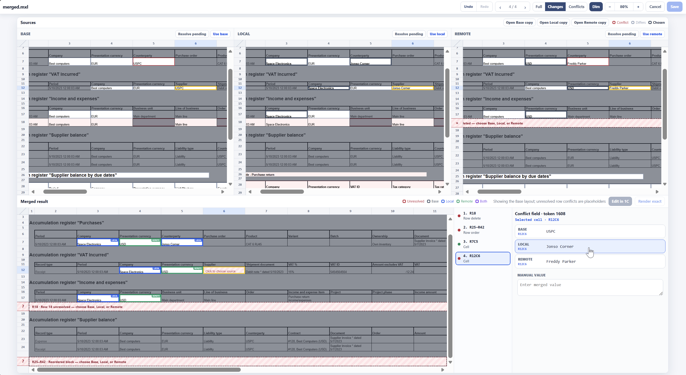

# MXL Merge Tool

Инструмент сравнения и трёхстороннего слияния табличных документов 1С в
формате `.mxl` (`MOXCEL`). Подключается к Git как diff- и merge-драйвер,
автоматически объединяет независимые изменения и открывает локальный редактор
для конфликтов.

Платформа 1С не требуется для diff и слияния. Она используется только для
точного HTML-предпросмотра документов.



## Возможности

- текстовый diff для бинарных `.mxl`;
- автоматическое трёхстороннее слияние Base, Local и Remote;
- разрешение конфликтов ячеек и строк в браузере;
- обработка добавления, удаления и перестановки строк;
- переставленный блок решается целиком, одной стороной, и не смешивается
  построчно;
- выбор Base, Local, Remote или ручного значения;
- переопределение автоматически выбранных изменений;
- одновременный предпросмотр источников и результата;
- режимы просмотра `Full`, `Changes`, `Conflicts`, затемнение неизменённого
  содержимого и масштаб;
- список конфликтов в панели результата с переходом по ним;
- открытие безопасных копий источников и ручная доработка результата в
  «1С:Предприятие — Работа с файлами»;
- координаты ячеек, навигация по конфликтам и Undo/Redo;
- проверка структуры перед записью результата;
- интеграция с Git, Git Extensions и другими Git-клиентами.

## Ограничения

- Поэлементное структурное слияние поддерживается для строк. Изменения колонок и
  нераспознанная структура разрешаются выбором целого Base, Local или Remote.
- Сохранение и удаление строк можно комбинировать с перестановками другой
  стороны. Противоречащие друг другу варианты порядка строк не сохраняются.
- Удаление строки, изменённой в другой ветке, всегда требует явного решения.
- Если одна сторона переставила блок строк, а другая изменила строки внутри его
  диапазона, порядок и структура блока берутся с одной стороны целиком.
  Построчно смешать такой блок нельзя.
- Подсветка в HTML сопоставляется по видимым значениям ячеек. Пустые строки и
  строки-разделители не содержат текста, поэтому не подсвечиваются и не
  участвуют в сопоставлении; повторяющиеся значения могут отображаться только в
  панели решений. На сам результат слияния это не влияет.
- Ручная доработка в 1С доступна после разрешения всех конфликтов. На время
  редактирования решения в merge-интерфейсе блокируются.

## Требования

- Git;
- Python 3.10 или новее — для macOS, Linux и запуска из исходников. Для Windows
  Python не нужен: он входит в архив;
- современный браузер;
- 1С:Предприятие — для точного HTML-предпросмотра
- 1С:Предприятие — Работа с файлами для внешнего редактирования MXL.

## Установка на Windows

1. Скачайте `mxl-merge-tool-<версия>-win64.zip` со страницы релизов.
2. Распакуйте в любую папку.
3. Двойной клик по `MXL merge tool.exe`.

Рядом с архивом на странице релиза лежит файл с суммой SHA-256; проверить
скачанный архив можно командой
`shasum -c mxl-merge-tool-<версия>-win64.zip.sha256`.

Откроется страница настройки в браузере. Она сама найдёт Git и установленные
версии 1С; при необходимости пути можно изменить. Кнопка «Установить»
настраивает diff- и merge-драйверы для всех ваших репозиториев. Права
администратора не нужны, Python устанавливать не нужно.

После установки распакованную папку можно удалить: файлы копируются в
`%LOCALAPPDATA%\mxl-merge-tool`.

Ярлык в меню «Пуск» не создаётся. Чтобы снова открыть страницу настройки и
изменить пути к 1С, запустите установленную копию:

```bat
"%LOCALAPPDATA%\mxl-merge-tool\0.3.0\MXL merge tool.exe"
```

Правый клик по папке репозитория даёт пункт «MXL merge: настроить этот
репозиторий» — он дописывает `.gitattributes` в конкретный проект.

Удаление — через «Программы и компоненты», пункт «MXL Merge Tool».

При обновлении распакуйте новый архив и снова запустите программу.
Переустановка обязательна: без неё Git будет отдавать закешированный diff
предыдущего формата.

## Установка из исходников

Из корня Git-репозитория:

```bash
python3 mxl_tool.py install
```

На Windows для полного функционала укажите тонкий клиент платформы и
«1С:Предприятие — Работа с файлами»:

```bat
python mxl_tool.py install ^
  --onec-client "C:\Program Files\1cv8\8.3.27.2074\bin\1cv8c.exe" ^
  --onec-file-editor "C:\Program Files (x86)\1cv8fv\bin\1cv8fv.exe"
```

`--onec-client` включает точный HTML-предпросмотр через 1С,
`--onec-file-editor` — открытие копий источников и ручное редактирование
результата. Если эти функции не нужны, достаточно `python mxl_tool.py install`.

Установщик настраивает локальные diff-, merge- и mergetool-драйверы и добавляет
в `.gitattributes`:

```gitattributes
*.mxl -text diff=mxl merge=mxl
```

Добавьте `.gitattributes` в репозиторий. Сам инструмент каждый разработчик
устанавливает локально один раз.

Проверка:

```bash
git check-attr diff merge -- path/to/template.mxl
```

Ожидаются атрибуты `diff: mxl` и `merge: mxl`.

### Глобальная установка

```bash
python3 /absolute/path/to/mxl_tool.py install --global
```

На Windows:

```bat
python C:\mxl_tool.py install --global
```

Git сохраняет абсолютный путь к `mxl_tool.py`, поэтому после установки каталог
инструмента нельзя перемещать.

## Предпросмотр через 1С

При установке с `--onec-client` файл `1cv8.exe` должен находиться рядом с
`1cv8c.exe`. При первом запуске инструмент автоматически создаст служебную базу
и подключит встроенную обработку. Base, Local и Remote преобразуются в HTML
пакетно за один запуск 1С.

Проверка конвертера:

```bat
python mxl_tool.py render-onec ^
  path\to\sample.mxl %TEMP%\sample-mxl.html
```

Пакетная проверка нескольких файлов за один запуск 1С:

```bat
python mxl_tool.py render-onec-batch %TEMP%\manifest.json
```

Манифест — JSON вида
`{"items": [{"name": "base", "inputPath": "…", "outputPath": "…"}]}`.

Свою базу или обработку можно задать параметрами `--onec-infobase`,
`--onec-epf` и `--onec-username`. Пароль передаётся через
`MXL_ONEC_PASSWORD`. Для собственного EPF с поддержкой пакетного манифеста
добавьте `--onec-batch-capable`.

`--onec-file-editor` настраивает приложение «1С:Предприятие — Работа с
файлами». Его можно указать и без `--onec-client`, если точный
HTML-предпросмотр не нужен.

## Использование

Git вызывает merge-драйвер автоматически:

```bash
git merge feature/my-branch
```

Если файл остался конфликтным, откройте редактор:

```bash
git mergetool --tool=mxl path/to/template.mxl
```

Локальная сессия завершится после `Save` или `Cancel`.

### Источники

- `Base` — общий предок веток;
- `Local` — текущая ветка;
- `Remote` — вливаемая ветка;
- `Merged result` — итоговый документ.

Клик по изменённой ячейке или строке открывает выбор источника. Односторонние
изменения выбираются автоматически, но их можно переопределить. Решения по
сохранению, удалению и расположению строк можно комбинировать.

Список конфликтов справа от результата показывает координату, тип и статус
каждого конфликта; клик по элементу переводит фокус на него. Переставленный блок
занимает в списке одну позицию: до выбора стороны он показан в результате единым
плейсхолдером `R… · Reordered block`, а после — содержимым выбранной стороны,
обведённым её цветом.

Над предпросмотром: `Full` показывает документ целиком, `Changes` выделяет
изменённые поля, `Conflicts` — только конфликтные; `Dim` затемняет неизменённое
содержимое, кнопки `−`/`+` меняют масштаб.

- `Use Base/Local/Remote` использует соответствующий исходный документ целиком.
- `Resolve pending` выбирает сторону только для конфликтов без решения.
- `All local/remote` заменяет все решения выбранной стороной.
- `Render exact` создаёт промежуточный MXL и обновляет его предпросмотр через 1С.
- `Open Base/Local/Remote copy` открывает отдельную read-only копию источника;
  оригинальный файл не меняется.
- `Edit in 1C` открывает отдельный MXL с текущими решениями. После сохранения и
  закрытия редактора предпросмотр обновляется автоматически; при необходимости
  используйте `Reload from 1C`. Кнопка `Edit again in 1C` повторно открывает ту
  же копию и сохраняет первоначальный результат для сравнения.
- Ручные изменения отмечаются `EDITED` или, например, `LOCAL → EDITED`.
  Пока они активны, решения в merge-интерфейсе заблокированы;
  `Discard manual edits` снимает блокировку и возвращает исходный результат.
- `Undo` и `Redo` работают также через `Ctrl/Cmd+Z`,
  `Ctrl/Cmd+Shift+Z` и `Ctrl/Cmd+Y`.
- `Save` проверяет и записывает результат; `Cancel` ничего не записывает.

## Git Extensions

После установки Git Extensions использует настройки из Git config. Для
конфликтного `.mxl` запустите mergetool и выберите `mxl`, если клиент запросит
инструмент. После `Save` файл будет отмечен как разрешённый.

Для диагностики используйте ту же команду в терминале:

```bash
git mergetool --tool=mxl relative/path/to/file.mxl
```

## Ручной запуск

Редактор можно открыть без Git-конфликта:

```bash
python3 mxl_tool.py ui \
  base.mxl local.mxl remote.mxl \
  --output merged.mxl
```

На Windows:

```bat
python mxl_tool.py ui ^
  C:\Temp\base.mxl C:\Temp\local.mxl C:\Temp\remote.mxl ^
  --output C:\Temp\merged.mxl
```

`--no-browser` выводит URL сессии без автоматического открытия браузера.

## Команды

Проверка структуры:

```bash
python3 mxl_tool.py validate file.mxl
```

Текстовое представление для diff:

```bash
python3 mxl_tool.py textconv file.mxl
```

Merge с явными файлами и отчётом:

```bash
python3 mxl_tool.py merge \
  base.mxl local.mxl remote.mxl \
  --output merged.mxl \
  --report conflict.json
```

## Свой HTML-конвертер

Вместо 1С можно подключить доверенный конвертер:

```bash
git config --local mxl.previewCommand \
  'path/to/converter {input} {output}'
```

Команда должна принять входной MXL, записать самодостаточный HTML и завершиться
после полной записи файла. Она запускается без shell.

Пакетный вариант:

```bash
git config --local mxl.previewBatchCommand \
  'path/to/batch-converter {manifest}'
```

Команды можно переопределить переменными окружения `MXL_PREVIEW_COMMAND` и
`MXL_PREVIEW_BATCH_COMMAND`. Пустое значение отключает внешний конвертер —
удобно, когда предпросмотр через 1С нежелателен, например в CI:

```bash
MXL_PREVIEW_COMMAND= MXL_PREVIEW_BATCH_COMMAND= python3 -m unittest discover -s tests
```

## Диагностика

Проверка настроек Git:

```bash
git check-attr diff merge -- path/to/file.mxl
git config --get merge.mxl.driver
git config --get mergetool.mxl.cmd
```

Проверка настроек предпросмотра:

```bash
git config --get mxl.onecClient
git config --get mxl.onecFileEditor
git config --get mxl.previewCommand
git config --get mxl.previewBatchCommand
```

Если Git-репозиторий не найден, проверьте текущий каталог:

```bash
git rev-parse --show-toplevel
```

Ошибки HTML-конвертера не блокируют семантический diff и разрешение конфликтов.
Отчёты merge-драйвера находятся в `.git/mxl-merge/reports`.

## Тесты

```bash
python3 -m unittest discover -s tests -v
```

## Сборка Windows-дистрибутива

Сборка выполняется на macOS или Linux и требует компилятора mingw-w64 и
`msitools` (для извлечения tkinter из отдельного MSI Python, поскольку
embeddable-сборка его не содержит):

```bash
brew install mingw-w64 msitools
python3 tools/build_windows.py
```

Скрипт скачивает embeddable-сборку Python и `tcltk.msi` с python.org,
извлекает из него tkinter и Tcl/Tk, компилирует лаунчер и упаковывает всё в
`dist/mxl-merge-tool-<версия>-win64.zip` (~14 МБ); рядом кладётся файл
`.sha256` с контрольной суммой архива.

Без компилятора mingw-w64 скрипт всё равно соберёт рабочий архив, но подставит
вместо лаунчера файл `Настроить.cmd` и пометит сборку как dev — такой архив не
для публикации.

Если у Python на машине сборки нет доверенного хранилища сертификатов,
скачивание падает с `CERTIFICATE_VERIFY_FAILED`. Решение — запустить скрипт с
переменной окружения `SSL_CERT_FILE`:

```bash
SSL_CERT_FILE=$(python3 -c "import certifi; print(certifi.where())") python3 tools/build_windows.py
```

### Выпуск новой версии

Номер версии задаётся в одном месте — `APP_VERSION` в `mxl_setup.py`. Скрипт
сборки берёт его оттуда и сам подставляет в имя архива, в каталог установки, в
запись «Программ и компонентов» и в ресурсы лаунчера, поэтому править версию в
`launcher.rc` или `launcher.manifest` не нужно: там стоят подстановочные
метки. Прогон тестов проверяет, что литерал версии не вернулся в эти файлы.

Порядок выпуска:

1. Поднять `APP_VERSION` в `mxl_setup.py`.
2. Добавить раздел новой версии в `CHANGELOG.md`.
3. `python3 -m unittest discover -s tests` — набор проверяет и согласованность
   версии с changelog.
4. `python3 tools/build_windows.py`.
5. Приложить архив и файл `.sha256` к релизу на странице проекта.

Пользователь обновляется повторным запуском установщика из нового архива.
Отдельного удаления прошлой версии не требуется: установка кладёт файлы в
каталог своей версии, переписывает конфигурацию Git и ключи реестра на новые
пути и удаляет каталоги прошлых версий. Переустановка при обновлении
**обязательна** — `TEXTCONV_FORMAT_VERSION` входит в ключ кеша textconv, и без
неё Git продолжит отдавать закешированный diff прежнего формата, ничем не
сообщая об этом.

## Безопасность

- локальный сервер слушает только loopback-интерфейс и использует случайный
  токен сессии;
- предпросмотры не загружают внешние сетевые ресурсы;
- исходные файлы не меняются до `Save`;
- результат проверяется и записывается атомарно;
- неоднозначные структурные решения не сохраняются.
